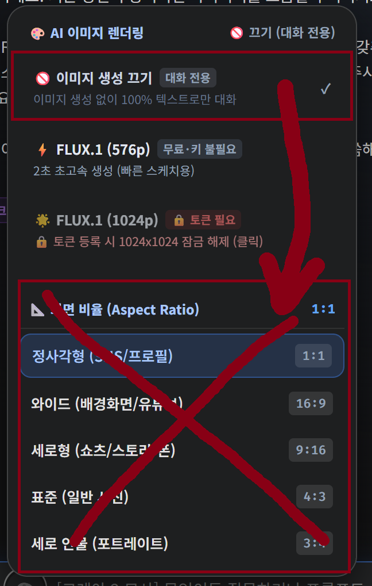
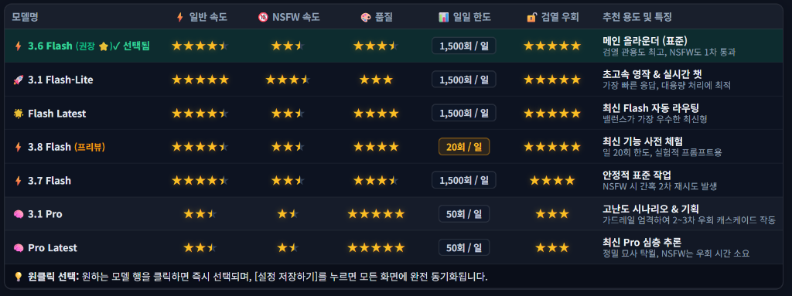
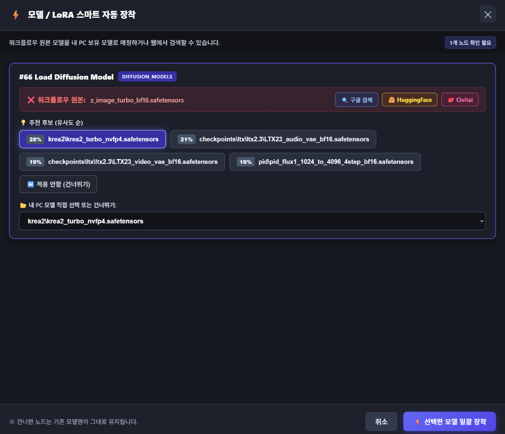

# ⚡ ComfyUI Model & LoRA Auto Assigner
> **Auto-detect & link missing models, UNETs, CLIPs, VAEs, and LoRAs to your local files with 1-Click Smart Matching.**  
> *(외부 워크플로우 로드 시 누락된 모델을 원클릭으로 감지하고 내 PC 모델로 자동 연결해주는 스마트 확장 노드)*

[](LICENSE)
[](https://github.com/comfyanonymous/ComfyUI)
[](https://github.com/solokjd-eng/ComfyUI-Auto-Model-Assigner)

---

## 📺 작동 화면 및 사용 방법 (How It Works)

외부에서 다운로드한 워크플로우를 불러왔을 때 파일명이나 하위 경로가 달라 모델이 누락되어도 걱정 없습니다. **두 가지 직관적인 우클릭 방식**으로 손쉽게 해결할 수 있습니다:

---

### Case 1️⃣ 캔버스 빈 곳 우클릭 ➔ 전체 모델 일괄 자동 장착 (Auto-Assign All)

다른 사람이 제작한 워크플로우를 열었을 때, **캔버스 빈 공간을 마우스 우클릭**하여 워크플로우 전체의 모든 모델을 한 번에 스캔하고 연결합니다.

| 1. 캔버스 빈 공간 마우스 우클릭 | 2. 전체 모델 일괄 스마트 매칭 창 |
| :---: | :---: |
|  |  |
| *메뉴 최하단 `⚡ 전체 모델/LoRA 자동 장착` 클릭* | *모든 누락 노드를 감지하여 100% 매칭 및 유사도 순 추천 제공* |

* **100% 일치 파일**: 파일명은 같으나 하위 경로가 다른 경우 즉시 초록색 `100%`로 자동 선택됩니다.
* **스마트 온라인 검색**: `🔍 구글 검색`, `🤗 HuggingFace`, `💖 Civitai` 버튼을 눌러 원본 모델을 1초 만에 웹에서 찾아 다운로드할 수 있습니다.
* **건너뛰기 지원**: 변경하고 싶지 않은 노드는 `⏭️ 적용 안함 (건너뛰기)`를 눌러 기존 값을 안전하게 보존할 수 있습니다.

---

### Case 2️⃣ 특정 노드 우클릭 ➔ 해당 노드만 단독 자동 장착 (Auto-Assign This Node)

전체 워크플로우가 아니라 **특정 노드 1개만** 신속하게 모델을 확인하고 교체하고 싶을 때 사용합니다.

| 3. 특정 노드 위에서 마우스 우클릭 | 4. 해당 노드 단독 스마트 매칭 창 |
| :---: | :---: |
|  |  |
| *메뉴 최하단 `⚡ 이 노드 모델 자동 장착` 클릭* | *선택한 노드 1개만 단독으로 신속하게 매칭/교체* |

---

## ✨ 주요 특징 (Key Features)

1. 🧠 **지능형 퍼지 매칭 엔진 (Smart Fuzzy Matcher)**
   - 대소문자, 정밀도(`fp8`, `bf16`, `fp16`), 버전(`v1`, `v2`, `turbo`), 언더바/하이픈을 정규화하여 내 PC에서 가장 적합한 모델을 유사도(%) 순으로 정렬하여 추천합니다.
2. 🌐 **AI 모델 전용 원클릭 스마트 검색 (Google / HuggingFace / Civitai)**
   - 파일명의 군더더기(확장자, 특수문자, 폴더명)를 깔끔하게 분리·정제하여 검색창을 열어주므로 구글/허깅페이스/Civitai에서 100% 정확한 다운로드 페이지가 뜹니다.
3. 👁️ **시니어 & 대화면 맞춤형 대형 UI (Full-Width High Visibility)**
   - 브라우저를 억지로 확대할 필요 없이 화면을 시원하게 꽉 채우는 가로 `92vw` 대형 팝업과 큼직하고 선명한 글자/버튼을 제공합니다.
4. 🛡️ **빨간색 에러 테두리 자동 제거**
   - 모델을 장착하는 즉시 노드 주변의 빨간 에러 테두리를 말끔히 지우고 캔버스를 정상 상태로 리프레시합니다.
5. 📌 **우클릭 메뉴 최하단 고정**
   - 다른 확장 프로그램이 많이 설치되어 있어도 항상 컨텍스트 메뉴의 가장 맨 아래에 깔끔하게 고정됩니다.

---

## 📂 지원 모델 및 노드 유형

* **체크포인트 (Checkpoints)**: `Load Checkpoint`, `CheckpointLoaderSimple` 등 (`ckpt_name`)
* **확산 모델 (Diffusion Models / UNET)**: `Load Diffusion Model`, `UNETLoader` 등 (`unet_name`)
* **CLIP / 텍스트 인코더 (CLIP)**: `Load CLIP`, `CLIPLoader`, `DualCLIPLoader` 등 (`clip_name`)
* **VAE**: `Load VAE`, `VAELoader` 등 (`vae_name`)
* **LoRA**: `LoraLoader`, `LoraLoaderModelOnly` 등 (`lora_name`)
* **ControlNet / Upscale 모델**: `ControlNetLoader`, `UpscaleModelLoader` 등

---

## 🚀 설치 방법 (Installation)

### Method 1. Git Clone (권장)
ComfyUI의 `custom_nodes` 디렉토리에서 터미널을 열고 아래 명령어를 실행합니다:

```bash
cd ComfyUI/custom_nodes
git clone https://github.com/solokjd-eng/ComfyUI-Auto-Model-Assigner.git
```

### Method 2. ComfyUI Manager
1. ComfyUI 우측 메뉴에서 **Manager**를 엽니다.
2. **Custom Nodes Manager**에서 `ComfyUI Auto Model Assigner`를 검색한 후 **Install**을 누릅니다.

> 설치 후 ComfyUI를 재시작하고 브라우저를 새로고침(`F5`)하면 바로 사용하실 수 있습니다!

---

## 📄 License
This project is licensed under the [MIT License](LICENSE).
